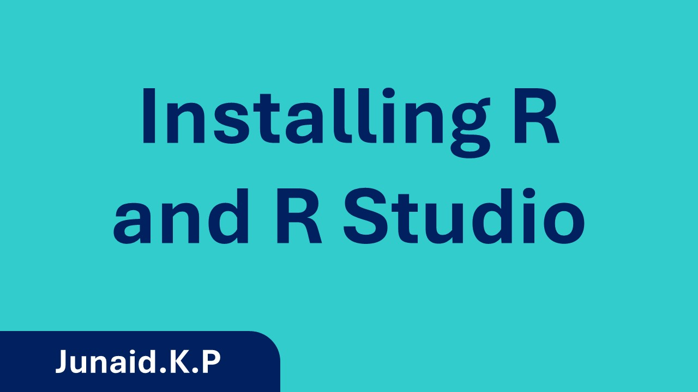
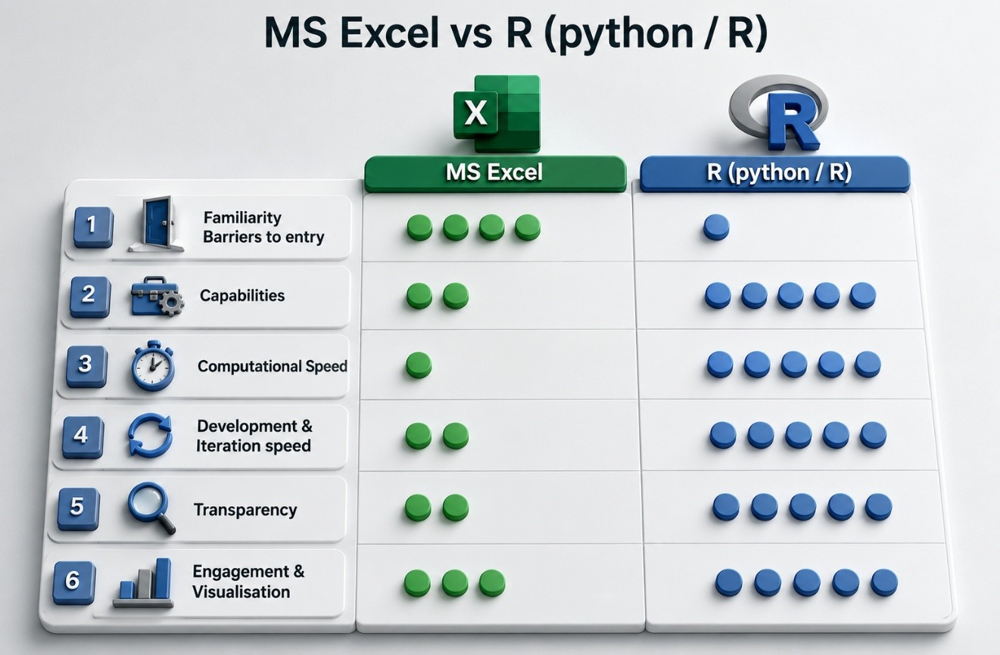
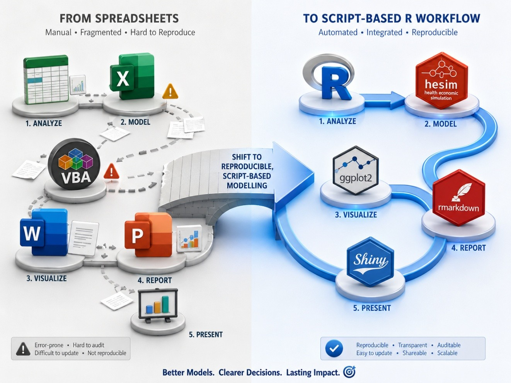
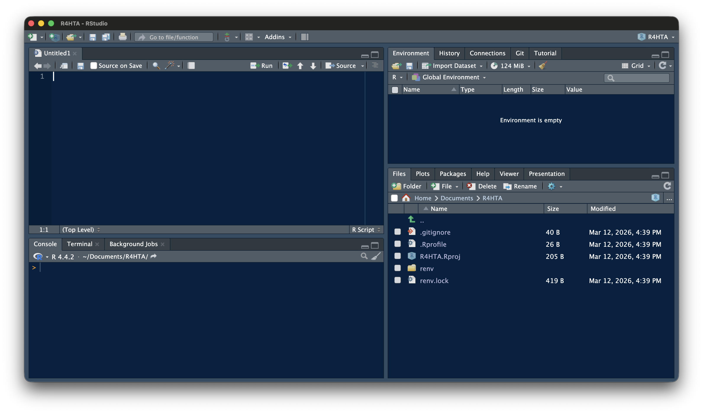
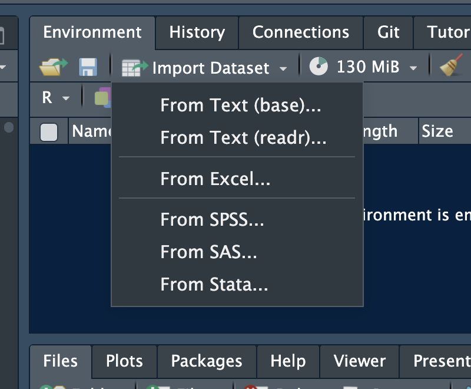

{fig-align="center"}

# Introduction: R for Health Technology Assessment (Basics)

This workshop introduces R as a tool for health technology assessment. It is designed for scientists at Regional Resource Centres (RRCs), health economists, and anyone working in or interested in HTA who currently uses Excel or TreeAge and wants to explore what R can offer.

**This is not a coding bootcamp.** You will not memorise R syntax. Instead, you will:

- Understand *why* R is increasingly preferred for HTA in academic and policy settings.

- See real-world Indian HTA examples implemented in R.

- Learn to *read* R code well enough to understand what a model is doing.

- **Modify** existing code — change inputs, adapt parameters, rerun analyses.

- Take home ready-to-use templates for four common HTA model types.

- Learn how to use available tools (including generative AI) to support your R workflow.

## Topics Covered

- Introduction to R and RStudio
- Data import and cleaning
- Descriptive statistics
- Data visualization
- Regression analysis
- Report generation using Quarto

## Installing R and R studio

Please ensure you have:

1.  **R** installed (version 4.3 or later) — [Download R](https://cran.r-project.org/)
2.  **RStudio** installed — [Download RStudio](https://posit.co/download/rstudio-desktop/)
3.  Required packages installed — run the setup code in the [Setup Guide](resources/setup-guide.html)

[Watch the video on YouTube](https://www.youtube.com/watch?v=CNNQtX822V4) [](https://www.youtube.com/watch?v=CNNQtX822V4)

## R vs Excel

A side-by-side comparison of how the same HTA tasks look in Excel versus R — making the case for transparency, reproducibility, and scalability.

## What R Makes Possible

R does not replace your HTA knowledge. It gives you a **different medium** to express that knowledge — one that is:



**Reproducible:** Your entire analysis is a script. Anyone can re-run it and get the same result. The `set.seed()` function ensures that even probabilistic analyses produce identical output across runs, machines, and collaborators.

**Scalable:** Running 10,000 PSA iterations takes a fraction of a second. Running 100,000 is equally easy. Excel slows to a crawl; R does not.

**Transparent:** A reviewer can read your code and see exactly what you did. No hidden cell references, no buried macros. Every assumption is explicit.

**Version-controlled:** With Git, every change is tracked, documented, and reversible. No more `Model_v3_final_FINAL_revised.xlsx`.

**Free and extensible:** No license fees, no vendor lock-in. Thousands of R packages exist for health economics (`heemod`, `hesim`, `dampack`, `BCEA`), survival analysis (`flexsurv`, `survminer`), Bayesian methods, and visualisation.

Shifting the modelling pipeline from spreadsheet software (e.g. MS Excel) to script-based programming languages (e.g R).



::: {.callout-tip title="Key Takeaway"}
R is not replacing your HTA expertise — it is giving that expertise a more powerful medium. The clinical judgement, the model structuring, the parameter selection — that remains yours. R simply makes the execution more reproducible, transparent, and scalable.
:::

## The RStudio Interface

When you open RStudio, you see four panels. Understanding what each one does will help you follow along in every session.

 - **Source Editor (top-left):** Where you write and edit code files (`.R`, `.qmd`) - **Console (bottom-left):** Where code runs and output appears - **Environment (top-right):** Shows all variables and data currently in memory - **Files / Plots / Help (bottom-right):** File browser, plot viewer, package documentation

## Your First Code

Run the chunk below to confirm everything is working. Click the green ▶ button.

```{r}
#| label: first-code
#| echo: true

print("Coding for better health decisions.")
```

If you see the text printed below the chunk, your setup is working correctly.

### Comments

In R, the `#` symbol marks a **comment** — anything after it on that line is ignored by R. Comments are notes for the human reading the code, not instructions for the computer. You will see them throughout every session. Read them — they are often the clearest explanation of what a section of code is doing.

```{r}
#| echo: true
#| eval: false

# Print the text
print("Coding for better health decisions.")

print("Coding for better health decisions.") # Print the text

# Multi-line comment
# about printing the text
print("Coding for better health decisions.")
```

## Assignment

In R, you store a value under a name using the **assignment operator** `<-`. Once stored, you can use the name anywhere in place of the value.

```{r}
#| label: assignment
#| echo: true

text <- "Coding for better health decisions."
print(text)
```

When you see `<-` in workshop code, you know: **this is where a value is stored, and this is what you change** to explore a different scenario.

You may occasionally see `->` or `=` used for assignment in older code. Prefer `<-` in your own work.

## Operators

### Arithmetic

R handles all standard arithmetic. These operators appear throughout model calculations for costs, probabilities, and outcomes.

```{r}
#| label: arithmetic
#| echo: true

2 + 5    # Addition
73 - 32  # Subtraction
47 * 7   # Multiplication
86 / 3   # Division
8 ^ 2    # Exponentiation
```

### Relational

Relational operators compare two values and return `TRUE` or `FALSE`. You will encounter these inside conditional checks — for example, testing whether an ICER is below a cost-effectiveness threshold.

```{r}
#| label: relational
#| echo: true

5 > 6    # Greater than
5 < 6    # Less than
6 == 6   # Equal to — note the double == for comparison, not single =
8 >= 5   # Greater than or equal to
7 <= 10  # Less than or equal to
9 != 10  # Not equal to
```

## Objects

In R, everything is stored as an **object**. The three types you will encounter most in this workshop are vectors, matrices, and data frames.

### Vectors

A vector is an ordered collection of values. Create one with `c()` — short for "combine".

```{r}
#| label: vectors
#| echo: true

vec <- c(2, 4, 6, 8, 3, 5.5)
vec
```

Vectors can also have **named elements** — a pattern you will see constantly in HTA models, where each value corresponds to a health state or treatment strategy:

```{r}
#| label: named-vectors
#| echo: true

costs <- c(treatment_A = 5000, treatment_B = 3000, treatment_C = 7000)
costs
```

You can retrieve a specific element by its position in the vector:

```{r}
#| echo: true

vec[5]   # Fifth element of vec
```

### Matrix

A matrix is a two-dimensional object with rows and columns. In HTA, you will encounter matrices as **transition probability tables** for Markov models, where each cell holds the probability of moving from one health state to another.

```{r}
#| label: matrix
#| echo: true

mat <- matrix(1:36, nrow = 6, ncol = 6, byrow = FALSE)
mat
```

You can access a specific element, an entire column, or an entire row:

```{r}
#| echo: true

mat[3, 5]   # Element at row 3, column 5
mat[, 5]    # Entire column 5
mat[5, ]    # Entire row 5
```

### Matrix multiplication

```{r}
#| label: matrix-mult
#| echo: true

mat1 <- matrix(c(3, 5, 1, 9), nrow = 2, ncol = 2, byrow = FALSE)
mat2 <- matrix(c(7, 4, 2, 8), nrow = 2, ncol = 2, byrow = FALSE)

mat1 %*% mat2
```

### Data Frames

A data frame is R's equivalent of a spreadsheet table — rows are observations, columns are variables.

```{r}
#| label: dataframe
#| echo: true

age    <- c(12, 24, NA, 23, 65, 33)          # NA = missing value

gender <- c("M", "F", "F", "M", "M", "F")

occu   <- factor(c(1, 4, 3, 2, 4, 5),        # factor() = categorical variable
                 levels = c(1:5),
                 labels = c("Unemp", "Service", "Student", "Business", "Prof"))

dob    <- c(as.Date("1993-01-16"),            # as.Date() converts text to a date
            as.Date("1963-12-24"),
            as.Date("1971-01-05"),
            as.Date("1982-11-11"),
            as.Date("1984-05-15"),
            as.Date("1999-03-07"))

df <- data.frame(age, gender, occu, dob)
df
```

You access a specific column using `$`:

```{r}
#| echo: true

df$age
```

## Functions

A function takes one or more inputs (called **arguments**), does something with them, and returns an output. The general syntax is:

```{r}
#| echo: true
#| eval: false

function_name(argument1 = value1, argument2 = value2, ...)
```

For example, `mean()` calculates the average of a vector. The `na.rm = TRUE` argument tells it to remove missing values before calculating — without it, a single `NA` in the data will make the result `NA`.

```{r}
#| echo: true

mean(x = df$age, na.rm = TRUE)
```

::: callout-tip
## Getting help

Type `?` followed by any function name in the Console to open its documentation — arguments, return values, and worked examples:

``` r
?mean
?round
?ggplot
```
:::

## Packages

R's base installation covers the basics. **Packages** are collections of additional functions written by the R community that extend what R can do. Install a package once, load it at the start of each session.

```{r}
#| label: packages
#| echo: true
#| eval: false

# Install a package — only need to do this once
install.packages("dplyr")
```

```{r}
#| echo: true

# Load a package — need to do this each session
library(dplyr)

dplyr::glimpse(df)
```

**Analogy:** Installing is like downloading an app. Loading is like opening it. In this workshop, the packages you need are listed at the top of each session file — you do not need to find or choose them yourself.

Key packages used in this workshop:

| Package                  | Purpose                      |
|--------------------------|------------------------------|
| `ggplot2`                | Graphs and visualisation     |
| `dplyr`                  | Data manipulation            |
| `readxl`, `haven`, `rio` | Importing data               |
| `heemod`                 | Markov cohort models         |
| `BCEA`, `dampack`        | Cost-effectiveness analysis  |
| `flexsurv`               | Survival modelling           |
| `shiny`                  | Interactive web applications |

## Pipes

A pipe passes the output of one function directly into the next, letting you chain steps in a readable left-to-right sequence without creating intermediate objects. R has two pipe operators — `|>` (built into R) and `%>%` (from the `tidyverse`). They behave the same way in most situations.

```{r}
#| label: pipes
#| echo: true

df |>
  select(age, dob, occu) |>
  summarise(mean_age = mean(age, na.rm = TRUE))
```

Read this as: *take `df`, then select the age, dob, and occu columns, then calculate the mean age.* `select()` picks columns, `summarise()` calculates summaries. The pipe replaces deeply nested function calls with a sequence that reads the way you think.

## Importing Data

### Using the GUI

RStudio has a point-and-click import tool. Go to **File → Import Dataset** and choose your file type. RStudio generates the import code for you — a useful way to learn the syntax before writing it yourself.



### Importing with code

Once you know the syntax, code-based import is faster and fully reproducible:

```{r}
#| echo: true
#| eval: false

# CSV
data <- read.csv("files/data.csv")

# Excel
library(readxl)
data <- read_excel("files/data.xlsx")

# Stata and SPSS
library(haven)
data <- read_sav("files/data.sav")
data <- read_dta("files/data.dta")
```

The `rio` package provides a single `import()` function that detects the file format automatically — the simplest approach when you work with multiple file types:

```{r}
#| echo: true
#| eval: false

library(rio)
data <- rio::import("files/data.xlsx")
data <- rio::import("files/data.csv")
data <- rio::import("files/data.sav")
data <- rio::import("files/data.dta")
```

::: callout-important
All import commands use **relative file paths** that only work when the `.Rproj` file has been opened first. A `cannot open file` error almost always means this step was skipped.
:::

## Loops

A `for` loop repeats a block of code a fixed number of times — once for each value in a sequence. In HTA modelling, loops are used to run the model across time cycles and across thousands of PSA iterations.

```{r}
#| label: loops
#| echo: true
#| eval: true

library(rio)
data <- rio::import("files/data.csv")
library(dplyr)
data <- data |> mutate(bmi = round(wt / ((ht / 100)^2), 1))

for (i in 1:nrow(data)) {
  bmi <- round(data$wt[i] / ((data$ht[i] / 100)^2), 2)
  cat("BMI of Record No", i, "is", bmi, "\n")
}
```

When you see a `for` loop in the workshop code, you know: **the model is repeating a calculation**. You do not need to understand every line — just recognise that something is being done repeatedly, and that the values at the top of the loop control what is being repeated and how many times.

## Conditional Logic

An `if/else` block runs different code depending on whether a condition is `TRUE` or `FALSE`. You will see this used in cost-effectiveness decisions — is the ICER below the willingness-to-pay threshold? — and in model checks.

```{r}
#| echo: true
#| eval: false

if (condition) {
  # code to run if condition is TRUE
} else {
  # code to run if condition is FALSE
}
```

A simple example:

```{r}
#| label: conditional
#| echo: true

value <- 5000

if (value > 200) {
  cat("High")
} else {
  cat("Low")
}
```

## Graphs

`ggplot2` is the standard package for data visualisation in R. It builds plots in layers — you start with the data, map variables to axes, then add geometric elements. The plot below uses the dataset imported in the Loops section.

```{r}
#| label: ggplot
#| echo: true
#| eval: true
#| fig-cap: "Height vs Weight coloured by BMI"

library(ggplot2)

ggplot(data, aes(x = ht, y = wt, colour = bmi)) +
  geom_point(size = 2) +
  labs(x = "Height", y = "Weight", title = "Height vs Weight") +
  theme_minimal()
```

When you see `ggplot` in the workshop code, you know: **a chart is being created.** The `aes()` part maps variables to visual properties, the `geom_` function determines the chart type, and `labs()` sets the labels. Changing the data or the variables inside `aes()` changes the plot.

## Three Things to Remember

Almost nothing from this session needs to be memorised. Instead, keep these three things in mind throughout the workshop:

::: {.callout-note icon="false"}
## 1. Values are stored with `<-`

Change them by editing the number on the right. Every exercise in this workshop is essentially this action.
:::

::: {.callout-note icon="false"}
## 2. Code runs top to bottom

Run chunks in order. If you see an error about an object not being found, scroll up and run the chunks above first.
:::

::: {.callout-note icon="false"}
## 3. Read the error message

It usually tells you exactly what went wrong — a missing package, a typo in a variable name, a file not found. Read it before asking for help.
:::

Everything else you can look up as needed — or ask an AI tool, as we will discuss in Session 7.

## Try It Yourself

Before moving to Session 3, modify the values below and re-run the chunk. Change the costs and QALYs to see how the ICER and the cost-effectiveness decision change.

```{r}
#| label: try-it
#| echo: true

# YOUR TASK: Change these values and re-run
cost_A <- 3000   # Cost of intervention A in ₹
cost_B <- 1500   # Cost of intervention B in ₹
qaly_A <- 0.82   # QALYs gained with A
qaly_B <- 0.75   # QALYs gained with B

# ── Do not modify below this line ─────────────────────────────────────────────

icer <- (cost_A - cost_B) / (qaly_A - qaly_B)
cat("ICER = ₹", round(icer, 0), "per QALY gained\n")

wtp <- 100000
if (icer < wtp) {
  cat("→ Cost-effective at WTP = ₹", format(wtp, big.mark = ",", scientific = FALSE), "\n")
} else {
  cat("→ NOT cost-effective at WTP = ₹", format(wtp, big.mark = ",", scientific = FALSE), "\n")
}
```

If you ran this and changed the result — you are ready for the rest of the workshop.

------------------------------------------------------------------------

## Quick Reference {.unnumbered}

| Concept         | Syntax                 | Example                 |
|-----------------|------------------------|-------------------------|
| Assign a value  | `name <- value`        | `cost <- 5000`          |
| Named vector    | `c(name = value)`      | `c(A = 5000, B = 3000)` |
| Index a vector  | `vec[n]`               | `vec[5]`                |
| Matrix multiply | `%*%`                  | `trace %*% tm`          |
| Access a column | `df$col`               | `df$age`                |
| Function syntax | `fn(arg = val)`        | `mean(x, na.rm = TRUE)` |
| Pipe            | `\|>`                  | `df \|> select(age)`    |
| If / else       | `if (cond) {} else {}` | `if (icer < wtp) {...}` |
| Get help        | `?function`            | `?mean`                 |
| Comment         | `#`                    | `# this is a note`      |

## Further Reading

- Baio, G. (2012). *Bayesian Methods in Health Economics*. CRC Press.
- Briggs, A., Sculpher, M., & Claxton, K. (2006). *Decision Modelling for Health Economic Evaluation*. Oxford University Press.
- R-HTA Consortium: [r-hta.org](https://r-hta.org)
