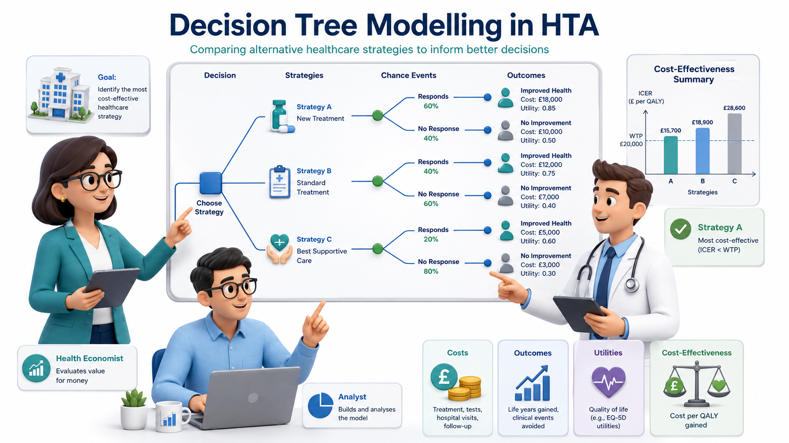

{fig-align="center"}

# Decision Tree Modelling in R

## The Clinical Question

Gestational Diabetes Mellitus (GDM) affects approximately 10–14% of pregnancies in India — substantially higher than Western countries. Undetected GDM increases risks of macrosomia, birth injuries, neonatal hypoglycaemia, pre-eclampsia, and future type 2 diabetes in the mother.

The question for HTA is: **Should India implement universal screening for GDM using a fasting 75g OGTT, or is risk-based screening (screening only high-risk women) more cost-effective?**

This is a classic **diagnostic decision tree** problem — the kind of analysis you might currently do in Excel or TreeAge. We will build it step by step in R.

## The Decision Problem

We compare three strategies:

1. **Universal screening:** All pregnant women receive a fasting 75g OGTT at 24–28 weeks (IADPSG criteria)
2. **Risk-based screening:** Only women with risk factors (age >25, BMI >25, family history of diabetes, previous GDM) receive OGTT
3. **No formal screening:** GDM detected only when symptomatic (status quo in many rural settings)

## Model Parameters

All parameters are sourced from Indian studies where available. Let us define them in R:

```{r}
#| label: parameters
#| echo: true

# ============================================================
# MODEL PARAMETERS — Gestational Diabetes Screening in India
# ============================================================

# --- Prevalence ---
# Source: Systematic review, Behboudi-Gandevani et al. 2019;
#         National meta-analysis, Pujitha et al. 2024 (BMC Public Health)
# Indian GDM prevalence ranges 10-14.3%; we use 12% as base case
prev_gdm <- 0.12

# --- Population ---
# We model a cohort of 10,000 pregnant women
n_cohort <- 10000

# --- Risk-based screening coverage ---
# Proportion of women classified as "high risk" and offered screening
# Source: FOGSI guidelines; approximately 55-65% of Indian pregnant women
#         have at least one risk factor
prop_high_risk <- 0.60

# GDM prevalence among high-risk vs low-risk women
# Source: Sreelakshmi et al. 2015 (IJRCOG)
prev_gdm_high_risk <- 0.18
prev_gdm_low_risk  <- 0.03

# --- Test Accuracy: Fasting 75g OGTT (IADPSG criteria) ---
# Source: Defined as the reference standard; near-perfect when properly
#         conducted. We use realistic performance accounting for
#         pre-analytical errors in field conditions.
# Source: Seshiah et al. 2008; Mohan et al. 2014
sens_ogtt <- 0.90   # Sensitivity
spec_ogtt <- 0.85   # Specificity

# --- Screening Costs (₹) ---
# Source: Estimated from public hospital rates, NHM guidelines
cost_ogtt <- 250            # Cost of fasting 75g OGTT per woman
cost_risk_assessment <- 50  # Cost of risk factor assessment per woman

# --- Treatment Cost if GDM Detected (₹) ---
# Includes dietary counselling, glucose monitoring, insulin if needed
# Source: Estimated from Indian tertiary hospital data
cost_gdm_treatment <- 8000

# --- Outcome Probabilities ---
# Probability of adverse outcome (composite: macrosomia, birth injury,
# neonatal ICU admission, pre-eclampsia) if GDM is:
# Source: HAPO study (international); Indian data from Balaji et al. 2011
p_adverse_gdm_treated   <- 0.10  # GDM detected and treated
p_adverse_gdm_untreated <- 0.35  # GDM present but undetected
p_adverse_no_gdm        <- 0.05  # No GDM (background risk)

# --- Costs of Adverse Outcomes (₹) ---
# Source: Estimated from Indian NICU costs, C-section rates
cost_adverse <- 45000   # Average cost of managing adverse outcome
cost_no_adverse <- 5000 # Average cost of normal delivery

# --- Utility Weights (QALYs) ---
# Short-term utility over pregnancy and postpartum period
# Source: Moss et al. 2007 (international); adapted for Indian context
utility_adverse   <- 0.65  # QALY weight if adverse outcome
utility_no_adverse <- 0.90 # QALY weight if no adverse outcome
utility_gdm_treated <- 0.82 # QALY weight for managed GDM (reduced anxiety, monitoring burden)
```

::: {.callout-note}
## A Note on Data Sources
Where Indian-specific utility data was not available, we have adapted values from international studies with appropriate acknowledgement. In your own HTA work, you would ideally conduct a local utility study or use regionally validated EQ-5D values. The parameter values here are illustrative and should be updated with the best available evidence for a formal HTA submission.
:::

## Building the Decision Tree

```{r}
#| label: fig-gdm-decision-tree
#| echo: true
#| fig-cap: "Decision tree structure for GDM screening strategies"
#| 
library(DiagrammeR)

grViz("
digraph gdm_tree {
  graph [rankdir=LR, bgcolor='transparent', fontname='Helvetica', nodesep=0.5]
  node [fontname='Helvetica', fontsize=10]
  D [label='Screening\nStrategy', shape=box, style='filled', fillcolor='#4e79a7', fontcolor='white', width=1.2]
  
  # Strategy nodes
  S1 [label='Universal\n Screening\n(All women get OGTT)', shape=box, style='filled,rounded', fillcolor='#59a14f', fontcolor='white']
  S2 [label='Risk-Based\n Screening\n(High-risk get OGTT)', shape=box, style='filled,rounded', fillcolor='#f28e2b', fontcolor='white']
  S3 [label='No Formal\n Screening\n(Clinical detection only)', shape=box, style='filled,rounded', fillcolor='#e15759', fontcolor='white']

  # Chance nodes for Universal
  C1 [label='GDM+\n(prev=12%)', shape=circle, style=filled, fillcolor='#d4e6f1', width=0.8, fontsize=9]
  C2 [label='GDM-\n(88%)', shape=circle, style=filled, fillcolor='#d5f5e3', width=0.8, fontsize=9]
  
  # Test results
  TP [label='Test +\n(Sens=90%)\nTreat', shape=box, style='filled,rounded', fillcolor='#aed6f1', fontsize=9]
  FN [label='Test -\n(10%)\n Missed', shape=box, style='filled,rounded', fillcolor='#f5b7b1', fontsize=9]
  FP [label='Test +\n(1-Spec=15%)\n Unnec. treat', shape=box, style='filled,rounded', fillcolor='#fdebd0', fontsize=9]
  TN [label='Test -\n(Spec=85%)\n Correctly cleared', shape=box, style='filled,rounded', fillcolor='#d5f5e3', fontsize=9]
  
  D -> S1
  D -> S2
  D -> S3

  S1 -> C1
  S1 -> C2
  
  C1 -> TP
  C1 -> FN
  C2 -> FP
  C2 -> TN}")

```


### Strategy 1: Universal Screening

Every woman gets an OGTT. Those who test positive receive treatment.

```{r}
#| label: universal-screening
#| echo: true

# --- Universal Screening Strategy ---

# Total number screened
n_screened_universal <- n_cohort

# True disease status
n_gdm_true <- n_cohort * prev_gdm        # Women who truly have GDM
n_no_gdm   <- n_cohort * (1 - prev_gdm)  # Women without GDM

# Test results
true_positive  <- n_gdm_true * sens_ogtt             # GDM detected correctly
false_negative <- n_gdm_true * (1 - sens_ogtt)       # GDM missed
false_positive <- n_no_gdm * (1 - spec_ogtt)         # Wrongly flagged
true_negative  <- n_no_gdm * spec_ogtt               # Correctly cleared

cat("=== Universal Screening Results ===\n")
cat("Total screened:", n_screened_universal, "\n")
cat("True positives (GDM detected):", true_positive, "\n")
cat("False negatives (GDM missed):", false_negative, "\n")
cat("False positives (unnecessary treatment):", false_positive, "\n")
cat("True negatives (correctly cleared):", true_negative, "\n")
```

```{r}
#| label: fig-test-results-universal
#| echo: true
#| fig-cap: "Distribution of screening test results — Universal Screening"

library(ggplot2)

test_results <- data.frame(
  Category = c("True Positive\n(GDM detected)", "False Negative\n(GDM missed)",
                "False Positive\n(Wrongly flagged)", "True Negative\n(Correctly cleared)"),
  Count = c(true_positive, false_negative, false_positive, true_negative),
  Type = c("Correct", "Error", "Error", "Correct")
)

ggplot(test_results, aes(x = reorder(Category, -Count), y = Count, fill = Type)) +
  geom_col() +
  geom_text(aes(label = round(Count)), vjust = -0.5, size = 3.5) +
  scale_fill_manual(values = c("Correct" = "#59a14f", "Error" = "#e15759")) +
  labs(x = "", y = "Number of Women",
       title = "Screening Test Results: Universal Strategy",
       subtitle = paste0("Cohort of ", format(n_cohort, big.mark=","), " pregnant women")) +
  theme_minimal() +
  theme(legend.position = "bottom", axis.text.x = element_text(size = 9))
```

Now let us calculate costs and outcomes:

```{r}
#| label: universal-costs
#| echo: true

# --- Costs: Universal Screening ---

# Screening cost: everyone gets OGTT
cost_screening_universal <- n_cohort * cost_ogtt

# Treatment costs: true positives + false positives receive treatment
cost_treatment_universal <- (true_positive + false_positive) * cost_gdm_treatment

# Adverse outcome costs
# True positives: GDM treated → lower adverse probability
adverse_tp <- true_positive * p_adverse_gdm_treated
no_adverse_tp <- true_positive * (1 - p_adverse_gdm_treated)

# False negatives: GDM untreated → higher adverse probability
adverse_fn <- false_negative * p_adverse_gdm_untreated
no_adverse_fn <- false_negative * (1 - p_adverse_gdm_untreated)

# False positives: no GDM but treated → background adverse risk
adverse_fp <- false_positive * p_adverse_no_gdm
no_adverse_fp <- false_positive * (1 - p_adverse_no_gdm)

# True negatives: no GDM, correctly cleared → background risk
adverse_tn <- true_negative * p_adverse_no_gdm
no_adverse_tn <- true_negative * (1 - p_adverse_no_gdm)

# Total adverse outcomes and costs
total_adverse_universal <- adverse_tp + adverse_fn + adverse_fp + adverse_tn
total_no_adverse_universal <- no_adverse_tp + no_adverse_fn + no_adverse_fp + no_adverse_tn

cost_outcomes_universal <- total_adverse_universal * cost_adverse +
                           total_no_adverse_universal * cost_no_adverse

# Total cost
total_cost_universal <- cost_screening_universal + cost_treatment_universal +
                        cost_outcomes_universal

cat("=== Universal Screening: Cost Summary ===\n")
cat("Screening cost: ₹", format(cost_screening_universal, big.mark = ","), "\n")
cat("Treatment cost: ₹", format(cost_treatment_universal, big.mark = ","), "\n")
cat("Outcome costs: ₹", format(round(cost_outcomes_universal), big.mark = ","), "\n")
cat("TOTAL COST: ₹", format(round(total_cost_universal), big.mark = ","), "\n")
cat("\nAdverse outcomes:", round(total_adverse_universal), "out of", n_cohort, "\n")
```

```{r}
#| label: universal-qalys
#| echo: true

# --- QALYs: Universal Screening ---

# QALYs by group
qaly_tp <- true_positive * ((1 - p_adverse_gdm_treated) * utility_gdm_treated +
           p_adverse_gdm_treated * utility_adverse)
qaly_fn <- false_negative * ((1 - p_adverse_gdm_untreated) * utility_no_adverse +
           p_adverse_gdm_untreated * utility_adverse)
qaly_fp <- false_positive * ((1 - p_adverse_no_gdm) * utility_gdm_treated +
           p_adverse_no_gdm * utility_adverse)
qaly_tn <- true_negative * ((1 - p_adverse_no_gdm) * utility_no_adverse +
           p_adverse_no_gdm * utility_adverse)

total_qaly_universal <- qaly_tp + qaly_fn + qaly_fp + qaly_tn

cat("Total QALYs (Universal Screening):", round(total_qaly_universal, 1), "\n")
cat("Mean QALY per woman:", round(total_qaly_universal / n_cohort, 4), "\n")
```

### Strategy 2: Risk-Based Screening

Only high-risk women are offered OGTT. Low-risk women are not screened.

```{r}
#| label: risk-based
#| echo: true

# --- Risk-Based Screening Strategy ---

n_high_risk <- n_cohort * prop_high_risk
n_low_risk  <- n_cohort * (1 - prop_high_risk)

# Among high-risk women
n_gdm_hr    <- n_high_risk * prev_gdm_high_risk
n_no_gdm_hr <- n_high_risk * (1 - prev_gdm_high_risk)

tp_hr <- n_gdm_hr * sens_ogtt
fn_hr <- n_gdm_hr * (1 - sens_ogtt)
fp_hr <- n_no_gdm_hr * (1 - spec_ogtt)
tn_hr <- n_no_gdm_hr * spec_ogtt

# Among low-risk women (NOT screened — GDM undetected)
n_gdm_lr    <- n_low_risk * prev_gdm_low_risk
n_no_gdm_lr <- n_low_risk * (1 - prev_gdm_low_risk)

cat("=== Risk-Based Screening Results ===\n")
cat("High-risk women screened:", n_high_risk, "\n")
cat("Low-risk women NOT screened:", n_low_risk, "\n")
cat("GDM detected (high-risk true positives):", tp_hr, "\n")
cat("GDM missed in high-risk (false negatives):", fn_hr, "\n")
cat("GDM missed in low-risk (never screened):", n_gdm_lr, "\n")
cat("Total GDM missed:", fn_hr + n_gdm_lr, "\n")
```

```{r}
#| label: risk-based-costs
#| echo: true

# --- Costs: Risk-Based Screening ---

# Screening cost: risk assessment for all, OGTT only for high-risk
cost_screening_risk <- n_cohort * cost_risk_assessment + n_high_risk * cost_ogtt

# Treatment cost: only high-risk true positives + false positives
cost_treatment_risk <- (tp_hr + fp_hr) * cost_gdm_treatment

# Adverse outcomes
# High-risk: detected GDM (treated)
adverse_tp_hr <- tp_hr * p_adverse_gdm_treated
# High-risk: missed GDM (untreated)
adverse_fn_hr <- fn_hr * p_adverse_gdm_untreated
# High-risk: false positives (background risk)
adverse_fp_hr <- fp_hr * p_adverse_no_gdm
# High-risk: true negatives
adverse_tn_hr <- tn_hr * p_adverse_no_gdm
# Low-risk: undetected GDM
adverse_gdm_lr <- n_gdm_lr * p_adverse_gdm_untreated
# Low-risk: no GDM
adverse_no_gdm_lr <- n_no_gdm_lr * p_adverse_no_gdm

total_adverse_risk <- adverse_tp_hr + adverse_fn_hr + adverse_fp_hr +
                      adverse_tn_hr + adverse_gdm_lr + adverse_no_gdm_lr

total_no_adverse_risk <- n_cohort - total_adverse_risk  # Simplified

cost_outcomes_risk <- total_adverse_risk * cost_adverse +
                      total_no_adverse_risk * cost_no_adverse

total_cost_risk <- cost_screening_risk + cost_treatment_risk + cost_outcomes_risk

cat("=== Risk-Based Screening: Cost Summary ===\n")
cat("Screening cost: ₹", format(cost_screening_risk, big.mark = ","), "\n")
cat("Treatment cost: ₹", format(round(cost_treatment_risk), big.mark = ","), "\n")
cat("Outcome costs: ₹", format(round(cost_outcomes_risk), big.mark = ","), "\n")
cat("TOTAL COST: ₹", format(round(total_cost_risk), big.mark = ","), "\n")
cat("\nAdverse outcomes:", round(total_adverse_risk), "out of", n_cohort, "\n")
```

```{r}
#| label: risk-based-qalys
#| echo: true

# --- QALYs: Risk-Based Screening ---

qaly_tp_hr <- tp_hr * ((1 - p_adverse_gdm_treated) * utility_gdm_treated +
              p_adverse_gdm_treated * utility_adverse)
qaly_fn_hr <- fn_hr * ((1 - p_adverse_gdm_untreated) * utility_no_adverse +
              p_adverse_gdm_untreated * utility_adverse)
qaly_fp_hr <- fp_hr * ((1 - p_adverse_no_gdm) * utility_gdm_treated +
              p_adverse_no_gdm * utility_adverse)
qaly_tn_hr <- tn_hr * ((1 - p_adverse_no_gdm) * utility_no_adverse +
              p_adverse_no_gdm * utility_adverse)
qaly_gdm_lr <- n_gdm_lr * ((1 - p_adverse_gdm_untreated) * utility_no_adverse +
               p_adverse_gdm_untreated * utility_adverse)
qaly_no_gdm_lr <- n_no_gdm_lr * ((1 - p_adverse_no_gdm) * utility_no_adverse +
                  p_adverse_no_gdm * utility_adverse)

total_qaly_risk <- qaly_tp_hr + qaly_fn_hr + qaly_fp_hr +
                   qaly_tn_hr + qaly_gdm_lr + qaly_no_gdm_lr

cat("Total QALYs (Risk-Based Screening):", round(total_qaly_risk, 1), "\n")
cat("Mean QALY per woman:", round(total_qaly_risk / n_cohort, 4), "\n")
```

### Strategy 3: No Formal Screening

GDM is detected only when symptomatic (estimated detection rate ~25% based on clinical presentation alone).

```{r}
#| label: no-screening
#| echo: true

# --- No Screening Strategy ---

# Detection rate through clinical presentation alone
detection_rate_clinical <- 0.25

n_gdm_total <- n_cohort * prev_gdm
n_no_gdm_total <- n_cohort * (1 - prev_gdm)

n_gdm_detected_clinical <- n_gdm_total * detection_rate_clinical
n_gdm_undetected <- n_gdm_total * (1 - detection_rate_clinical)

# Costs: no screening cost, treatment only for clinically detected
cost_screening_none <- 0
cost_treatment_none <- n_gdm_detected_clinical * cost_gdm_treatment

# Adverse outcomes
adverse_detected <- n_gdm_detected_clinical * p_adverse_gdm_treated
adverse_undetected <- n_gdm_undetected * p_adverse_gdm_untreated
adverse_no_gdm_none <- n_no_gdm_total * p_adverse_no_gdm

total_adverse_none <- adverse_detected + adverse_undetected + adverse_no_gdm_none
total_no_adverse_none <- n_cohort - total_adverse_none

cost_outcomes_none <- total_adverse_none * cost_adverse +
                      total_no_adverse_none * cost_no_adverse

total_cost_none <- cost_screening_none + cost_treatment_none + cost_outcomes_none

# QALYs
qaly_detected <- n_gdm_detected_clinical * ((1 - p_adverse_gdm_treated) * utility_gdm_treated +
                 p_adverse_gdm_treated * utility_adverse)
qaly_undetected <- n_gdm_undetected * ((1 - p_adverse_gdm_untreated) * utility_no_adverse +
                   p_adverse_gdm_untreated * utility_adverse)
qaly_no_gdm_none <- n_no_gdm_total * ((1 - p_adverse_no_gdm) * utility_no_adverse +
                    p_adverse_no_gdm * utility_adverse)

total_qaly_none <- qaly_detected + qaly_undetected + qaly_no_gdm_none

cat("=== No Screening: Results ===\n")
cat("GDM detected clinically:", n_gdm_detected_clinical, "out of", n_gdm_total, "\n")
cat("TOTAL COST: ₹", format(round(total_cost_none), big.mark = ","), "\n")
cat("Adverse outcomes:", round(total_adverse_none), "out of", n_cohort, "\n")
cat("Total QALYs:", round(total_qaly_none, 1), "\n")
```

## Comparing the Three Strategies

```{r}
#| label: comparison
#| echo: true

# --- Summary Comparison ---
library(knitr)

results <- data.frame(
  Strategy = c("Universal Screening", "Risk-Based Screening", "No Screening"),
  Total_Cost = c(total_cost_universal, total_cost_risk, total_cost_none),
  Total_QALYs = c(total_qaly_universal, total_qaly_risk, total_qaly_none),
  Adverse_Outcomes = c(total_adverse_universal, total_adverse_risk, total_adverse_none)
)

# Format for display
results$Cost_per_Woman <- results$Total_Cost / n_cohort
results$QALY_per_Woman <- results$Total_QALYs / n_cohort
results$Adverse_Rate <- paste0(round(results$Adverse_Outcomes / n_cohort * 100, 1), "%")

results$Total_Cost <- paste0("₹", format(round(results$Total_Cost), big.mark = ","))

kable(results[, c("Strategy", "Total_Cost", "QALY_per_Woman", "Adverse_Rate")],
      col.names = c("Strategy", "Total Cost (cohort)", "QALY per Woman", "Adverse Outcome Rate"),
      digits = 4,
      caption = "Comparison of GDM Screening Strategies (cohort of 10,000 women)")
```

```{r}
#| label: fig-adverse-comparison
#| echo: true
#| fig-cap: "Adverse outcome rates and costs across screening strategies"

adverse_data <- data.frame(
  Strategy = c("Universal\nScreening", "Risk-Based\nScreening", "No\nScreening"),
  Adverse_Rate = c(total_adverse_universal / n_cohort * 100,
                   total_adverse_risk / n_cohort * 100,
                   total_adverse_none / n_cohort * 100),
  Cost_Per_Woman = c(total_cost_universal / n_cohort,
                     total_cost_risk / n_cohort,
                     total_cost_none / n_cohort)
)

library(gridExtra)

p1 <- ggplot(adverse_data, aes(x = Strategy, y = Adverse_Rate, fill = Strategy)) +
  geom_col(show.legend = FALSE) +
  geom_text(aes(label = paste0(round(Adverse_Rate, 1), "%")), vjust = -0.5, size = 3.5) +
  scale_fill_manual(values = c("#59a14f", "#f28e2b", "#e15759")) +
  labs(x = "", y = "Adverse Outcome Rate (%)",
       title = "Adverse Outcomes") +
  theme_minimal()

p2 <- ggplot(adverse_data, aes(x = Strategy, y = Cost_Per_Woman, fill = Strategy)) +
  geom_col(show.legend = FALSE) +
  geom_text(aes(label = paste0("₹", format(round(Cost_Per_Woman), big.mark=","))), vjust = -0.5, size = 3) +
  scale_fill_manual(values = c("#59a14f", "#f28e2b", "#e15759")) +
  labs(x = "", y = "Cost per Woman (₹)",
       title = "Total Cost per Woman") +
  theme_minimal()

grid.arrange(p1, p2, ncol = 2)
```

## ICER and Net Monetary Benefit

```{r}
#| label: icers
#| echo: true

library(knitr)

# --- ICER Calculations ---
# Using no screening as the reference comparator

# Risk-based vs No screening
inc_cost_risk_vs_none <- total_cost_risk - total_cost_none
inc_qaly_risk_vs_none <- total_qaly_risk - total_qaly_none
icer_risk_vs_none <- inc_cost_risk_vs_none / inc_qaly_risk_vs_none

# Universal vs No screening
inc_cost_univ_vs_none <- total_cost_universal - total_cost_none
inc_qaly_univ_vs_none <- total_qaly_universal - total_qaly_none
icer_univ_vs_none <- inc_cost_univ_vs_none / inc_qaly_univ_vs_none

# Universal vs Risk-based
inc_cost_univ_vs_risk <- total_cost_universal - total_cost_risk
inc_qaly_univ_vs_risk <- total_qaly_universal - total_qaly_risk
icer_univ_vs_risk <- inc_cost_univ_vs_risk / inc_qaly_univ_vs_risk

# WTP threshold
wtp_india <- 170000

# --- 4-quadrant ICER interpretation ---
interpret_icer <- function(dc, dq, wtp) {
  if (dc < 0 & dq > 0) return("DOMINANT")
  if (dc > 0 & dq < 0) return("DOMINATED")
  if (dc > 0 & dq > 0) return(if (dc/dq < wtp) "Cost-effective" else "Not CE")
  return("Trade-off (cheaper but worse)")
}

# Summary table
kable(data.frame(
  Comparison = c("Risk-Based vs No Screening",
                 "Universal vs No Screening",
                 "Universal vs Risk-Based"),
  `Incr Cost/woman (₹)` = c(
    paste0("₹", format(round(inc_cost_risk_vs_none / n_cohort), big.mark = ",")),
    paste0("₹", format(round(inc_cost_univ_vs_none / n_cohort), big.mark = ",")),
    paste0("₹", format(round(inc_cost_univ_vs_risk / n_cohort), big.mark = ","))
  ),
  `Incr QALYs/woman` = c(
    round(inc_qaly_risk_vs_none / n_cohort, 4),
    round(inc_qaly_univ_vs_none / n_cohort, 4),
    round(inc_qaly_univ_vs_risk / n_cohort, 4)
  ),
  `ICER (₹/QALY)` = c(
    paste0("₹", format(round(icer_risk_vs_none), big.mark = ",")),
    paste0("₹", format(round(icer_univ_vs_none), big.mark = ",")),
    paste0("₹", format(round(icer_univ_vs_risk), big.mark = ","))
  ),
  Conclusion = c(
    interpret_icer(inc_cost_risk_vs_none, inc_qaly_risk_vs_none, wtp_india),
    interpret_icer(inc_cost_univ_vs_none, inc_qaly_univ_vs_none, wtp_india),
    interpret_icer(inc_cost_univ_vs_risk, inc_qaly_univ_vs_risk, wtp_india)
  ),
  check.names = FALSE
), align = "lrrrr",
   caption = paste0("Incremental cost-effectiveness (WTP = ₹", format(wtp_india, big.mark = ","), "/QALY)"))
```

### Net Monetary Benefit

The ICER can be ambiguous when negative (DOMINANT and DOMINATED both produce negative ratios). The NMB gives an unambiguous answer: positive ΔNMB = adopt.

```{r}
#| label: nmb
#| echo: true

# NMB = WTP × QALYs − Cost (per woman)
nmb_none <- wtp_india * (total_qaly_none / n_cohort) - (total_cost_none / n_cohort)
nmb_risk <- wtp_india * (total_qaly_risk / n_cohort) - (total_cost_risk / n_cohort)
nmb_univ <- wtp_india * (total_qaly_universal / n_cohort) - (total_cost_universal / n_cohort)

kable(data.frame(
  Strategy = c("No Screening", "Risk-Based Screening", "Universal Screening"),
  `NMB per woman (₹)` = c(
    paste0("₹", format(round(nmb_none), big.mark = ",")),
    paste0("₹", format(round(nmb_risk), big.mark = ",")),
    paste0("₹", format(round(nmb_univ), big.mark = ","))
  ),
  Ranking = rank(-c(nmb_none, nmb_risk, nmb_univ)),
  check.names = FALSE
), align = "lrr",
   caption = paste0("Net Monetary Benefit (WTP = ₹", format(wtp_india, big.mark = ","), "/QALY) — highest NMB is optimal"))
```

::: {.callout-tip}
## Reading the NMB Table
The strategy with the **highest NMB** is the optimal choice at the given WTP threshold. Unlike the ICER (which only compares pairs), NMB ranks all strategies simultaneously — making it easy to identify the best option when there are more than two comparators.
:::

## Visualising the Results

```{r}
#| label: results-plot
#| echo: true
#| fig-cap: "Cost-effectiveness comparison of GDM screening strategies"

library(ggplot2)

plot_data <- data.frame(
  Strategy = c("No Screening", "Risk-Based", "Universal"),
  Cost = c(total_cost_none / n_cohort,
           total_cost_risk / n_cohort,
           total_cost_universal / n_cohort),
  QALY = c(total_qaly_none / n_cohort,
           total_qaly_risk / n_cohort,
           total_qaly_universal / n_cohort)
)

ggplot(plot_data, aes(x = QALY, y = Cost, label = Strategy)) +
  geom_point(size = 4, colour = "steelblue") +
  geom_text(vjust = -1, hjust = 0.5, size = 3.5) +
  geom_line(linetype = "dashed", colour = "grey60") +
  labs(
    x = "QALYs per Woman",
    y = "Cost per Woman (₹)",
    title = "Cost-Effectiveness of GDM Screening Strategies",
    subtitle = "Cohort of 10,000 pregnant women — Indian setting"
  ) +
  theme_minimal() +
  expand_limits(y = 0)
```

## What You Just Did

Without writing any code from scratch, you followed a complete diagnostic decision tree analysis:

1. **Defined the clinical question** using Indian epidemiological data
2. **Structured the decision tree** with three screening strategies
3. **Populated it with parameters** from published Indian literature
4. **Calculated costs, QALYs, and ICERs** for each strategy
5. **Visualised the results** on a cost-effectiveness plane

In Excel, changing a single parameter (say, GDM prevalence) would require tracing through multiple cells. In R, you change one number at the top and re-run the entire analysis.

## Key References

- Pujitha KS et al. (2024). National and regional prevalence of gestational diabetes mellitus in India: a systematic review and meta-analysis. *BMC Public Health*.
- Seshiah V et al. (2008). Prevalence of gestational diabetes mellitus in South India. *JAPI*.
- Mohan V et al. (2014). Comparison of screening for GDM using IADPSG, DIPSI, and WHO 1999 criteria.
- Behboudi-Gandevani S et al. (2019). Worldwide prevalence of GDM: a systematic review.
- HAPO Study Cooperative Research Group (2008). Hyperglycemia and Adverse Pregnancy Outcomes. *NEJM*.
- NHM India. National Guidelines for Diagnosis & Management of Gestational Diabetes Mellitus.
- Moss JR et al. (2007). Cost-effectiveness of screening for GDM. *BJOG*.